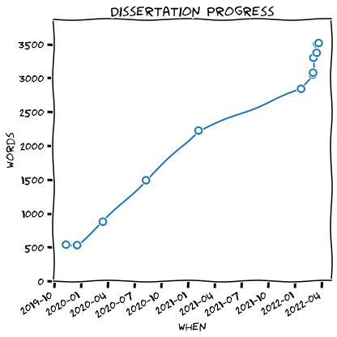
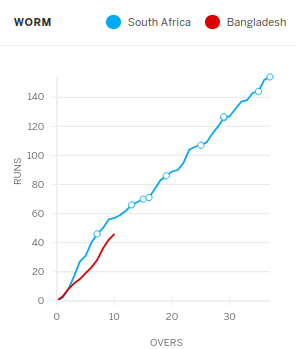

# Plot your latex word count over time

It has been said that a picture paints a thousand words.  But perhaps you need
to hit 20,000 words for your dissertation - this picture might just spur you on.

This very basic pair of scripts lets you do a word count and then show your
progress over time.

This mini-project was inspired by the "worm" visualisation on [ESPN's CricInfo
web site](https://espncricinfo.com).

## Requirements / Assumptions
- A unix-like installation (I used Ubuntu 20.04.4 LTS at the time).
- You are using LaTeX for your dissertation/project and all your `.tex` files
  are in one directory.
- The `texcount` program - it comes with the `texlive-extra-utils` package on my
  system.
- Python 3 with `pandas` and `seaborn`.
- Optionally, the `fonts-humor-sans` package if you want the xkcd-style plot.

## Usage
- Put (or link to) both the `countwords.sh` shell script and the
  `plotProgress.py` python script in your project directory (where your `.tex`
  files are).
- Run `countwords.sh` whenever you've done some work on your dissertation (or as
  part of your Makefile if you're automating things).  This will store your word
  count against today's date in a file called `progress.csv`.
- Run `plotProgress.py` when you want your plot.  This code can also be pasted
  into a Jupyter notebook.
  
## Disclaimer
- This was just a bit of silly fun, use it and adapt it as you wish.
